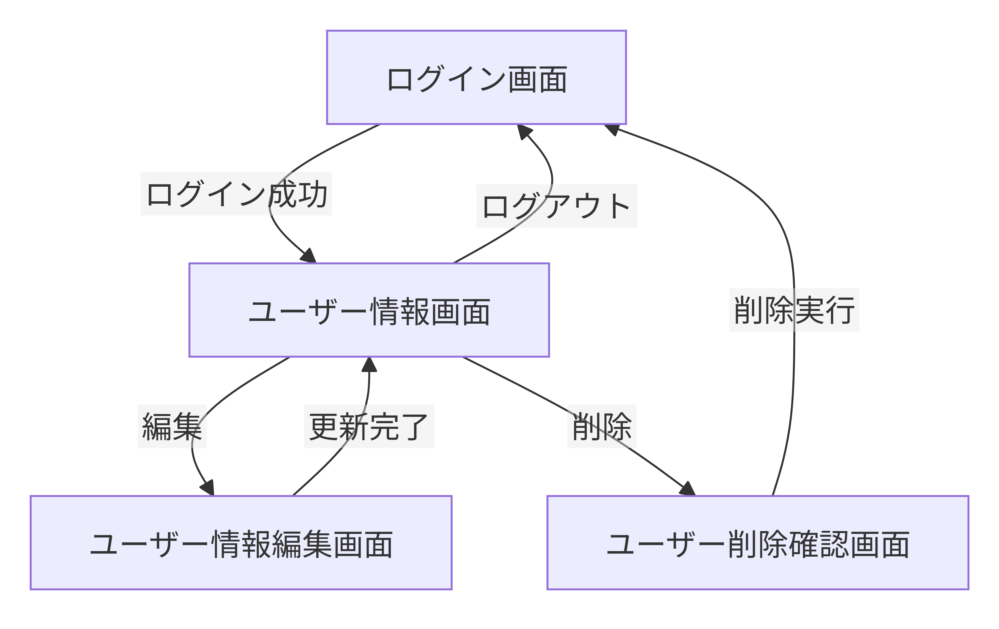
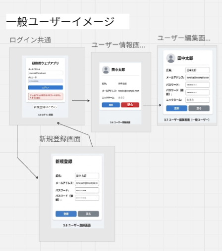

# 基本設計書

## 1. システム概要

### 1.1 システム目的

本システムは、ユーザー認証機能およびユーザー管理機能を提供するWebシステムである。

一般ユーザーは自身のユーザー情報を管理でき、管理者は全ユーザーの管理および権限設定を行うことができる。

本システムは研修課題として開発し、システム開発工程の理解を目的とする。


### 1.2 システム構成

本システムはWebブラウザから利用するWebアプリケーションとして構築する。

利用者はブラウザを通じてシステムへアクセスし、認証後にユーザー情報の管理を行う。

システムはアプリケーションとデータベースで構成し、ユーザー情報および認証情報をデータベースで管理する。

### システム構成図
```text
+------------------+
|     利用者       |
+------------------+
          |
          | HTTP
          v
+------------------+
| Webブラウザ      |
+------------------+
          |
          |
          v
+------------------+
| アプリケーション |
|      サーバ      |
+------------------+
          |
          |
          v
+------------------+
|   データベース    |
+------------------+
```

### 1.3 利用者区分
- 一般ユーザー
- 管理者

---

## 2. 機能設計

### 2.1 機能一覧
docs\basic_design\機能一覧.mdを参照ください。
---
## 3. 画面設計

### 3.1 画面一覧

docs\basic_design\画面一覧.mdを参照ください。

---

### 3.2 画面遷移図

#### 一般ユーザー




#### 管理者


---

### 3.3 画面設計詳細
docs\basic_design\画面設計詳細.mdを参照ください。
---
## 4 入出力定義

### 4.2 ユーザー登録

#### 一般ユーザー

**入力**

- 氏名
- メールアドレス
- パスワード

**出力**

- ユーザー登録結果
  - 成功
  - 失敗
- エラーメッセージ（入力不備時）

---

#### 管理者

**入力**

- 氏名
- メールアドレス
- パスワード
- 権限

**出力**

- ユーザー登録結果
  - 成功
  - 失敗
- エラーメッセージ（入力不備時）

---

### 4.3 ユーザー編集

#### 一般ユーザー

**入力**

- 氏名
- メールアドレス
- ニックネーム
- パスワード

**出力**

- ユーザー更新結果
  - 成功
  - 失敗
- 更新後ユーザー情報
- エラーメッセージ（入力不備時）

---

#### 管理者

**入力**

**管理者作成ユーザーの場合**

- 氏名
- メールアドレス
- ニックネーム
- パスワード
- 権限

**一般ユーザーが作成したユーザーの場合**

- 権限


**出力**

- ユーザー更新結果
  - 成功
  - 失敗
- 更新後ユーザー情報
- エラーメッセージ（入力不備時）

---

### 4.4 ユーザー削除

**入力**
#### 管理者
- 退会ボタン：クリック
#### 一般ユーザー
- 削除ボタン：クリック

**出力**

- ユーザー削除結果
  - 成功
  - 失敗
- エラーメッセージ（削除失敗時）

---

## 5 データ設計

### 5.1 テーブル一覧

| テーブル名 | 論理名 | 概要 |
|-----------|--------|------|
| users | ユーザー | ユーザー情報を管理する |

---

### 5.2 usersテーブル定義

| 項目名 | 型 | PK | NN | 説明 |
|---------|----|----|----|------|
| user_id | INT | ○ | ○ | ユーザーID |
| name | VARCHAR(50) | - | ○ | 氏名（最大50文字） |
| nickname | VARCHAR(15) | - | ○ | ニックネーム（最大15文字）
| email | VARCHAR(255) | - | ○ | メールアドレス |
| password | VARCHAR(255) | - | ○ | パスワード（ハッシュ化） |
| role | VARCHAR(20) | - | ○ | 権限（admin/user） |
| created_by | VARCHAR(20) | - | ○ | 作成種別（admin/user） |
| created_at | DATETIME | - | ○ | 作成日時 |
| updated_at | DATETIME | - | ○ | 更新日時 |

---

### 5.3 ER図

```text
+----------------+
|     users      |
+----------------+
| PK user_id     |
| name           |
| nickname       |
| email          |
| password       |
| role           |
| created_by     |
| created_at     |
| updated_at     |
+----------------+
```
---

## 6. 認証・セキュリティ設計

### 6.1 認証方式
- ユーザーIDおよびパスワードによる認証を行う。
- パスワードはハッシュ化して保存する。
- 通信はHTTPSにより暗号化する。
- 将来的なセキュリティ強化に備え、多要素認証（MFA）を導入可能な構成とする。
- 初期リリースではMFAは実装対象外とする。

### 6.2 セッション管理
#### セッション管理方式

- ユーザーのログイン成功時にセッションを発行する。
- セッションIDはシステムで一意に生成し、Cookieに保存する。
- セッション情報はサーバー側で管理する。

#### セッション有効期限

- 最終操作から60分間アクセスがない場合、セッションを自動的に失効させる。
- セッション失効後に画面操作を行った場合は、ログイン画面へ遷移させる。

#### ログアウト

- ユーザーがログアウトした時点でセッションを破棄する。
- ブラウザを閉じた場合は、次回アクセス時に再認証を要求する。
#### セキュリティ対策

- セッションIDは推測困難なランダム値を使用する。
- Cookieには「HttpOnly」および「Secure」属性を設定する。
- 通信はHTTPSを使用する。

#### 将来拡張

- 将来的な多要素認証（MFA）導入時にも利用可能なセッション管理方式とする。

### 6.3 権限制御

#### 権限管理方式
- ロールベースアクセス制御（RBAC）を採用する。
- ユーザーに付与されたロールに基づき、利用可能な機能を制御する。

#### ロール定義

| ロール | 権限 |
|----------|----------|
| 管理者 | 全機能の利用およびユーザー管理が可能 |
| 一般ユーザー | 自身に許可された機能のみ利用可能 |

#### アクセス制御
- ログイン後の利用機能は、付与されたロールに基づいて制御する。
- 権限のない画面および機能へのアクセスは禁止する。
- 不正なアクセスが行われた場合はエラーメッセージを表示する。

#### ユーザー管理
- 管理者はユーザーの登録、編集、削除を行うことができる。
- 管理者はユーザーのロールを変更することができる。

#### 将来拡張
- 将来的に複数ロールの追加や、機能単位での詳細な権限制御に対応可能な構成とする。

### 6.4 パスワード方針

#### パスワード要件
- パスワードは8文字以上32文字以内とする。
- 英大文字、英小文字、数字をそれぞれ1文字以上含むものとする。
- メールアドレスと同一のパスワードは設定できないものとする。

#### パスワード管理
- パスワードはハッシュ化して保存し、平文では保存しない。
- 利用者は任意のタイミングでパスワードを変更できる。

#### 将来拡張
- 将来的にパスワードの複雑性チェックや多要素認証（MFA）の導入、およびパスワード再設定に対応可能な構成とする。

### 6.5 アカウントロック

#### ロック条件
- ログイン認証に5回連続で失敗した場合、アカウントをロックする。

#### ロック解除
- パスワードの再設定を行うことでロックを解除できるものとする。※但し今回は、実装しない。

#### セキュリティ対策
- アカウントロック時はログイン画面にロック状態であることを表示する。
- アカウントロック時はパスワード再設定画面への遷移を案内する。※但し今回は、パスワード再設定画面・機能を実装しない。

---

## 7 ユーザーID採番ルール

#### 採番ルール
- ユーザーIDはシステムが自動採番する。
- ユーザー登録時に一意のユーザーIDを発行する。
- 利用者による入力および変更はできない。

##### チェック内容
- ユーザーIDの重複を許可しない。

## 8. 入力チェック設計

### 8.1 パスワード

#### 入力条件
- 必須入力とする。
- 8文字以上32文字以内とする。
- 英大文字、英小文字、数字をそれぞれ1文字以上含むものとする。
- メールアドレスと同一のパスワードは設定できないものとする。

#### エラーチェック
- 未入力チェック
- 文字数チェック
- 複雑性チェック
- ユーザーID一致チェック

---

### 8.2 氏名

#### 入力条件
- 必須入力とする。
- 50文字以内とする。

#### エラーチェック
- 未入力チェック
- 文字数チェック

---

### 8.3 メールアドレス

#### 入力条件
- 必須入力とする。
- 255文字以内とする。
- メールアドレス形式で入力するものとする。
- 他ユーザーと重複しないものとする。

#### エラーチェック
- 未入力チェック
- 文字数チェック
- 形式チェック
- 重複チェック

---

### 8.4 ニックネーム

#### 入力条件
- 任意入力とする。
- 15文字以内とする。

#### エラーチェック
- 文字数チェック

---

## 9. メッセージ設計

### 9.1 エラーメッセージ

| 項目 | メッセージ |
|--------|--------|
| パスワード未入力 | パスワードを入力してください。 |
| パスワード形式不正 | パスワードの形式が正しくありません。 |
| 氏名未入力 | 氏名を入力してください。 |
| メールアドレス未入力 | メールアドレスを入力してください。 |
| メールアドレス形式不正 | メールアドレスの形式が正しくありません。 |
| メールアドレス重複 | このメールアドレスは既に登録されています。 |
| ログイン失敗 | ユーザーIDまたはパスワードが正しくありません。 |
| アカウントロック | アカウントがロックされています。パスワードを再設定してください。 |
| 権限不足 | この機能を｛操作名｝する権限がありません。 |
| システムエラー | システムエラーが発生しました。 |

---

### 8.2 完了メッセージ

| 処理 | メッセージ |
|--------|--------|
| ユーザー登録 | ユーザーを登録しました。 |
| ユーザー更新 | ユーザー情報を更新しました。 |
| ユーザー削除 | ユーザーを削除しました。 |
| ログイン | ログインしました。 |
| ログアウト | ログアウトしました。 |
| パスワード変更 | パスワードを変更しました。 |
| 権限更新 | ｛ユーザー名｝を｛ロール名｝に変更しました。|