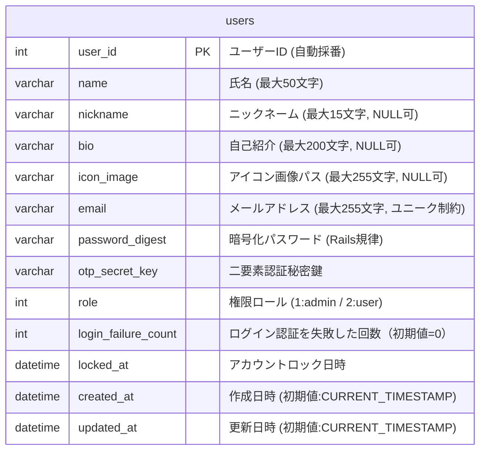

# 基本設計書

## 1. システム概要

### 1.1 システム目的

- 本システムは、**地域の町内会などのコミュニティにおいて、メンバー間の相互理解と交流を促進する「会員名簿・組織図アプリ」**である。

- 本システムは研修課題として開発し、システム開発工程の理解に加えて、仕様の深い把握、成果物の説明力、および主体的な問題発見・修正力を養うことを目的とする。

### 1.2 システム構成

本システムは、画面遷移をスムーズに行い直感的な操作性を実現するため、Webブラウザから利用する構成のWebアプリケーションとして構築する。

[Webブラウザ (React)] ────(非同期API通信: HTTPS / JSON)────> [Web APIサーバー (Ruby on Rails)] │ [データベース (SQLite3/PostgreSQL)]

- **フロントエンド（React）**:
  UI（ユーザーインターフェース）の動的描画、クライアントサイドにおけるルーティング、および名前検索（フィルター）などのインタラクティブな画面表示制御を担当する 。
- **バックエンド（Ruby / Ruby on Rails）**:
  データベースとの接続、ビジネスロジックの実行、およびフロントエンドに対してJSON形式でデータを返却する**RESTful APIサーバー**としての役割を担う 。
- **通信・認証方式**:
  フロントエンドとバックエンド間は非同期API通信（HTTPS）で接続し、セッションCookieを用いて安全にユーザーのログイン状態（セッション）を維持・管理する。

### システム構成図

```text
+------------------+
|     利用者       |
+------------------+
          |
          | HTTP
          v
+------------------+
| Webブラウザ      |
+------------------+
          |
          |
          v
+------------------+
| アプリケーション |
|      サーバ      |
+------------------+
          |
          |
          v
+------------------+
|   データベース    |
+------------------+
```

### 1.3 利用者区分

- 一般ユーザー
- 管理者
　* 管理者が0人になってはいけない.
  * 管理者が0人になる管理者削除イベントが発生した場合は、組織のアプリ退会と認識し、全ユーザーの情報を削除する。
---

## 2. 機能設計

### 2.1 機能一覧

docs\basic_design\機能一覧.mdを参照ください。
本システムは、主要機能として「ログイン機能」「マイページ参照・編集機能」「メンバー一覧表示機能（カード形式/名前検索対応）」「名簿管理機能（表形式/管理者専用/インライン権限変更・削除モーダル警告対応）」「アイコン画像アップロード機能」を備える。

---

## 3. 画面設計

### 3.1 画面一覧

docs\basic_design\画面一覧.mdを参照ください。
本システムは、SCR01（ログイン）、SCR02（メンバー一覧）、SCR03（詳細モーダル）、SCR04（マイページ）、SCR05（名簿管理）、SCR06（ユーザー登録）、SCR07（ユーザー編集）の計7つの画面・モーダルから構成される。

---

### 3.2 画面遷移図

詳細な画面遷移ルートおよびモーダル起動条件は docs\basic_design\画面遷移一覧.md を参照くだいさい。

---

### 3.3 画面設計詳細

## docs\basic_design\画面設計詳細.mdを参照ください。

## 4 入出力定義

### 4.1 ユーザー登録（SCR06）

一般ユーザー（自己登録）および管理者（代理登録）が共通して使用する入力項目。
「権限」の選択項目は廃止し、登録時はシステム側で一律「一般ユーザー（user）」として登録を行う。

**【入力】**

- 氏名（必須）
- メールアドレス（必須）
- パスワード（必須）

**【出力】**

- ユーザー登録結果（成功 / 失敗）
- エラーメッセージ（入力不備時、重複エラー時）

---

### 4.2 ユーザー編集（マイページ編集 SCR04 / 代理編集 SCR07）

自身のマイページ、または管理者が行う代理編集フォームの入力項目。フォーム表示項目は同じものを使用する。
ログイン情報、氏名、ニックネーム、自己紹介（bio）、アイコン画像を含む編集・保存ができる 。

**【入力】**

- アバターアイコン画像ファイル（任意：JPEG/PNG、2MB以内制限）
- 氏名（必須）
- メールアドレス（必須）
- パスワード（任意：変更時のみ入力）
- ニックネーム（任意）
- 自己紹介（bio）（任意） 

**【出力】**

- ユーザー更新結果（成功 / 失敗） 
- 更新後のユーザー情報（JSONデータ）
- エラーメッセージ（入力不備時、ファイル形式不適合時など）

---

### 4.3 ユーザー削除（名簿削除 F15 / 自己退会 F11）

画面遷移を伴わない「警告ポップアップモーダル」による削除・退会仕様 。

#### ① 管理者による他ユーザーの削除（名簿削除）

**【入力】**

- 削除ボタンクリック ➔ 削除の警告モーダル起動
- モーダル上の選択肢クリック（「いいえ」 / 「削除します」）

**【出力】**

- 「削除します」選択時：対象ユーザーの物理/論理削除結果（成功 / 失敗）
- 完了/エラーメッセージの表示およびテーブルのリアルタイム再描画

#### ② 管理者自身によるマイページからの退会

**【入力】**

- 退会するボタンクリック ➔ 退会の警告モーダル起動
- モーダル上の選択肢クリック（「いいえ」 / 「削除します」）

**【出力】**

- 「削除します」選択時：管理者自身のユーザー削除結果（成功 / 失敗） 
- 強制ログアウト処理、セッション破棄、およびログイン画面（SCR01）への遷移
---

### 4.6 権限インライン変更（F21）※管理者専用

名簿管理画面（SCR05）の「権限」バッジをクリックして、画面を遷移させずにその場で変更する仕様。

**【入力】**

- 権限バッジクリック ➔ 権限更新の警告モーダル起動 
- モーダル上の選択肢クリック（「いいえ」 / 「はい」）

**【出力】**

- 「はい」選択時：対象ユーザーの権限更新結果（成功 / 失敗）
- 完了メッセージの表示およびテーブル（バッジ表示）のリアルタイム再描画 

---

## 5. データ設計

### 5.1 テーブル一覧

本システムは単一の町内会で利用することを前提とする。
そのため、町内会を識別するための団体IDや組織テーブルは設けず、全ユーザーは同一町内会に所属するものとして扱う。
将来的に複数町内会への展開が必要となった場合は、organizationsテーブルの追加および users テーブルとの関連付けを行うことを想定する。

| テーブル名 | 論理名   | 概要                                                                                               |
| :--------- | :------- | :------------------------------------------------------------------------------------------------- |
| **users**  | ユーザー | 認証情報、権限ロール、ニックネーム、自己紹介、およびアバター画像を含むユーザー情報を一元管理する。 |

---

### 5.2 usersテーブル定義

カード形式でメンバーの個性を伝えるため、およびReact×Ruby APIでのファイルパス管理のために、`nickname`のほかに、自己紹介用の`bio`、アバター画像パスを記録する`icon_image`を拡張・追加する。

| 物理カラム名        | 論理カラム名     | データ型     | PK  | NN  | 初期値            | 説明                                                                       |
| :------------------ | :--------------- | :----------- | :-: | :-: | :---------------- | :------------------------------------------------------------------------- |
| **user_id**         | ユーザーID       | INT          |  ○  |  ○  | -                 | 自動採番される一意のID  。                                    |
| **name**            | 氏名             | VARCHAR(50)  |  -  |  ○  | -                 | 氏名（最大50文字）。                                            |
| **nickname**        | ニックネーム     | VARCHAR(15)  |  -  |  -  | NULL              | 組織図用ニックネーム（最大15文字）。                            |
| **bio**             | 自己紹介         | VARCHAR(200) |  -  |  -  | NULL              | メンバー紹介テキスト（最大200文字）。                                      |
| **icon_image**      | アイコン画像パス | VARCHAR(255) |  -  |  -  | NULL              | 保存先画像ファイル名またはパス（未設定時はデフォルト表示）。               |
| **email**           | メールアドレス   | VARCHAR(255) |  -  |  ○  | -                 | ログインIDを兼ねる（ユニーク制約）。                            |
| **password_digest** | パスワード       | VARCHAR(255) |  -  |  ○  | -                 | ハッシュ化されたパスワード文字列。Railsの has_secure_password 規則に準拠   |
| **otp_secret_key**  | 二要素認証秘密鍵 | VARCHAR(255) |  -  |  -  | NULL              | 管理者の二要素認証（TOTP）用の暗号化された秘密鍵。                         |
| **role**            | 権限ロール       | INT          |  -  |  ○  | 'user'            | アプリの操作権限。Railsの enum 機能等を用いて自動変換（1: admin, 2: user） |
| login_failure_count | ログイン失敗回数     | INT      |    | ○  | 0   | ログイン失敗時に加算される失敗回数を保持する |
| locked_at           | アカウントロック日時 | DATETIME |    |    | NULL | アカウントがロックされた日時を保持する |
| **created_at**      | 作成日時         | DATETIME     |  -  |  ○  | CURRENT_TIMESTAMP | レコード作成日。                                              |
| **updated_at**      | 更新日時         | DATETIME     |  -  |  ○  | CURRENT_TIMESTAMP | レコード最終更新日時。                                          |

---

### 5.3 ER図



---

## 6. 認証・セキュリティ設計

### 6.1

- メールアドレスおよび暗号化パスワードによる認証を行う。
- パスワードはハッシュ化してデータベース上の `password_digest` カラムに保存する。
- 通信はHTTPSにより暗号化する。
- 【管理者セキュリティ強化】管理者ロールを持つユーザーにのみ、スマートフォンの認証アプリ（Google Authenticator等）を使用した「TOTP（タイムベース・ワンタイムパスワード）認証」による二要素（多要素）認証を必須とする。
- 一般ユーザーについては、初期リリースではパスワード認証のみとし、二要素認証は適用外とする。

### 6.2 セッション管理

#### セッション管理方式

- ユーザーのログイン成功時にセッションを発行する。
- セッションIDはシステムで一意に生成し、Cookieに保存する。
- セッション情報はサーバー側で管理する。

#### セッション有効期限

- 最終操作から60分間アクセスがない場合、セッションを自動的に失効させる。
- セッション失効後に画面操作を行った場合は、ログイン画面へ遷移させる。

#### ログアウト

- ユーザーがログアウトした時点でセッションを破棄する。
- ブラウザを閉じた場合は、次回アクセス時に再認証を要求する。

#### セキュリティ対策

- セッションIDは推測困難なランダム値を使用する。
- Cookieには「HttpOnly」および「Secure」属性を設定する。
- 通信はHTTPSを使用する。

#### 将来拡張

- 将来的な多要素認証（MFA）導入時にも利用可能なセッション管理方式とする。

### 6.3 権限制御

#### 権限管理方式

- ロールベースアクセス制御（RBAC）を採用する。
- ユーザーに付与されたロールに基づき、利用可能な機能を制御する。

#### ロール定義

| **管理者 (admin)** | 
- 全メンバーの「カード形式一覧（SCR02）」「詳細モーダル（SCR03）」の参照。<br>
- 「名簿管理画面（SCR05）」へのアクセス、新規代理登録、代理編集、および他人の名簿削除。<br>
- 名簿管理画面上での「インライン権限変更」。<br>
- 自身のマイページ（SCR04）における「退会（自己削除）」 。 

| **一般ユーザー (user)** | 
- 全メンバーの「カード形式一覧（SCR02）」「詳細モーダル（SCR03）」の参照（他人のプロフィールは参照専用、変更は不可。<br>
- 自身のマイページ（SCR04）におけるプロフィール更新。<br>
- **【退会禁止】自身のマイページからの「退会（削除）」ボタンは完全に非表示とし、退会を不可とする**。 

#### アクセス制御

- ログイン後の利用機能は、付与されたロールに基づいて制御する。
- 権限のない画面および機能へのアクセスは禁止する。
- 不正なアクセスが行われた場合はエラーメッセージを表示する。

- **フロントエンド（React）における制御**:
  ログインユーザーのロールを判定し、一般ユーザーログイン時は、共通ヘッダーから「名簿管理」リンクを完全に排除し、自身のマイページ（SCR04）から「退会する」ボタンを非表示（DOM上に描画しない）とする。
- **バックエンド（Ruby on Rails）における制御**:
  APIコントローラーにおいてロールによるフィルターを実装する 。一般ユーザーのセッションから「他ユーザー登録」「代理編集」「他ユーザー削除」「権限変更」などの管理者専用APIリクエスト、および「一般ユーザー自身の自己削除（退会）API」が送信された場合、**即座に処理を遮断し 403 Forbidden（権限不足エラー）を返却する** 。

#### 将来拡張

- 将来的に複数ロールの追加や、機能単位での詳細な権限制御に対応可能な構成とする。

### 6.4 パスワード方針

#### パスワード要件

- パスワードは8文字以上32文字以内とする。
- 英大文字、英小文字、数字をそれぞれ1文字以上含むものとする。
- メールアドレスと同一のパスワードは設定できないものとする。

#### パスワード管理

- パスワードはハッシュ化して保存し、平文では保存しない。
- 利用者は任意のタイミングでパスワードを変更できる。

#### 将来拡張

- 将来的にパスワードの複雑性チェックや多要素認証（MFA）の導入、およびパスワード再設定に対応可能な構成とする。

### 6.5 アカウントロック

#### ロック条件

- ログイン認証に5回連続で失敗した場合、アカウントをロックする。

#### ロック解除

- 60分後に自然アンロック

#### セキュリティ対策

- アカウントロック時はログイン画面にロック状態であることを表示する。
- しばらく時間をおいて再度お試しください。と表示

---

## 7 ユーザーID採番ルール

#### 採番ルール

- ユーザーIDはシステムが自動採番する。
- ユーザー登録時に一意のユーザーIDを発行する。
- 利用者による入力および変更はできない。

##### チェック内容

- ユーザーIDの重複を許可しない。

## 8. 入力チェック設計

### 8.1 パスワード

#### 入力条件

- 必須入力とする。
- 8文字以上32文字以内とする。
- 英大文字、英小文字、数字をそれぞれ1文字以上含むものとする。
- メールアドレスと同一のパスワードは設定できないものとする。

#### エラーチェック

- 未入力チェック
- 文字数チェック
- 複雑性チェック
- ユーザーID一致チェック

---

### 8.2 氏名

#### 入力条件

- 必須入力とする。
- 50文字以内とする。

#### エラーチェック

- 未入力チェック
- 文字数チェック

---

### 8.3 メールアドレス

#### 入力条件

- 必須入力とする。
- 255文字以内とする。
- メールアドレス形式で入力するものとする。
- 他ユーザーと重複しないものとする。

#### エラーチェック

- 未入力チェック
- 文字数チェック
- 形式チェック
- 重複チェック

---

### 8.4 ニックネーム

#### 入力条件

- 任意入力とする。
- 15文字以内とする。

#### エラーチェック

- 文字数チェック

---

### 8.5 自己紹介文

#### 入力条件

- 任意入力とする 。
- 200文字以内とする 。

#### エラーチェック

- 文字数チェック 

---

### 8.5 アイコン画像（新規追加項目）

#### 入力条件

- 任意アップロード（未設定時はシステム規定のデフォルトアバター画像を表示）。

#### エラーチェック

- **ファイル形式チェック**: 拡張子およびMIMEタイプが `image/jpeg` または `image/png` であること。
- **ファイルサイズチェック**: 1ファイルあたり**最大2MB以内**であること。

---

## 9. メッセージ設計

### 9.1 エラーメッセージ

| 項目                   | メッセージ                                                               |
| ---------------------- | ------------------------------------------------------------------------ |
| パスワード未入力       | パスワードを入力してください。                                           |
| パスワード形式不正     | パスワードの形式が正しくありません。                                     |
| 氏名未入力             | 氏名を入力してください。                                                 |
| メールアドレス未入力   | メールアドレスを入力してください。                                       |
| メールアドレス形式不正 | メールアドレスの形式が正しくありません。                                 |
| メールアドレス重複     | このメールアドレスは既に登録されています。                               |
| 画像形式不正           | JPEGまたはPNG形式の画像ファイルを選択してください。                      |
| 画像サイズ上限超過     | ファイルサイズが大きすぎます。2MB以内の画像を選択してください。          |
| ログイン失敗           | メールアドレスまたはパスワードが正しくありません。                       |
| アカウントロック       | アカウントがロックされています。しばらく時間をおいて再度お試しください。 |
| 権限不足               | この機能を｛操作名｝する権限がありません。                               |
| システムエラー         | システムエラーが発生しました。                                           |

---

### 9.2 完了メッセージ

| 処理           | メッセージ                                   |
| -------------- | -------------------------------------------- |
| ユーザー登録   | ユーザーを登録しました。                     |
| ユーザー更新   | ユーザー情報を更新しました。                 |
| ユーザー削除   | ユーザーを削除しました。                     |
| ログイン       | ログインしました。                           |
| ログアウト     | ログアウトしました。                         |
| パスワード変更 | パスワードを変更しました。                   |
| 権限更新       | ｛ユーザー名｝を｛ロール名｝に変更しました。 |
