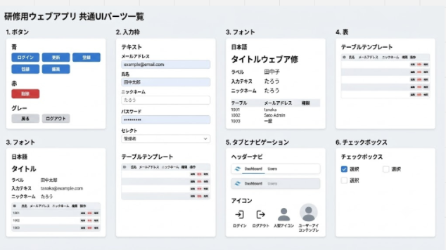
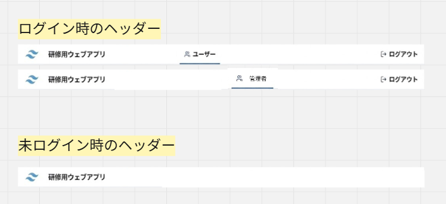
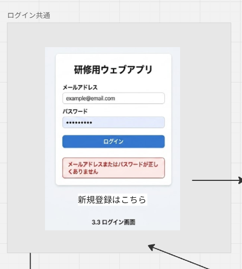
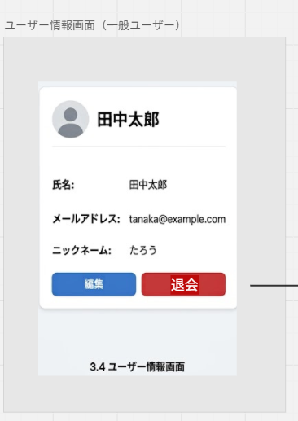
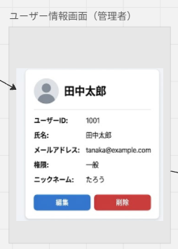
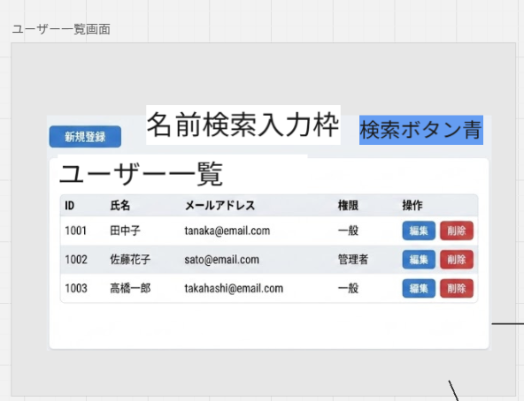
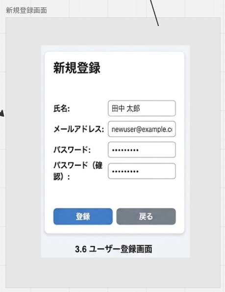
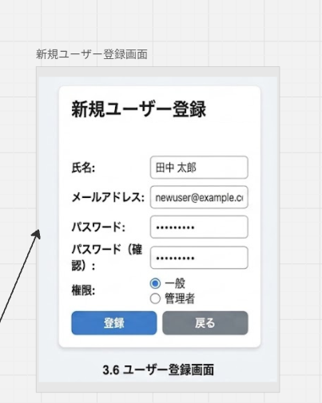
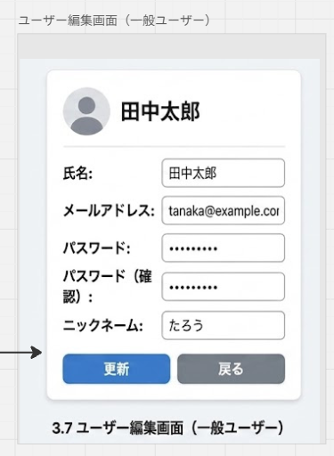
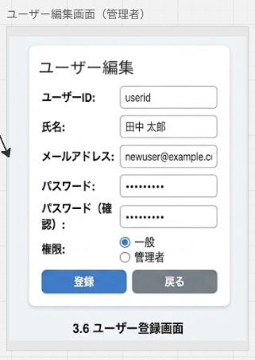

# 画面設計詳細

### 1 共通部品

#### 1.1 共通UIパーツ

##### 概要

システム全体で共通利用するUI部品を定義する。

各画面では以下の共通パーツを利用し、画面全体の操作性およびデザインの統一を図る。

対象となる共通部品は以下のとおりである。

- ボタン
- 入力フォーム
- フォント
- テーブル
- ヘッダー・ナビゲーション
- アイコン
- チェックボックス

##### 共通UI部品一覧

| 部品名 | 用途 |
|----------|----------|
| ボタン | 登録、更新、削除、検索、画面遷移などの処理実行に利用する |
| 入力フォーム | ユーザー情報や検索条件の入力に利用する |
| フォント | システム全体で統一した文字表現に利用する |
| テーブル | 一覧形式でのデータ表示に利用する |
| ヘッダー・ナビゲーション | 画面間の遷移およびログアウト機能を提供する |
| アイコン | 操作内容を視覚的に表現する |
| チェックボックス | 複数選択項目の入力に利用する |

##### イメージ

#### 1.2 ヘッダー

##### 概要

システム全体で利用する共通ヘッダーである。

未ログイン時はシステム名のみを表示する。

ログイン後は利用者の権限に応じて一般ユーザーか管理者かを表示し、ログアウト機能を提供する。

##### 項目

| 項目名 | 説明 |
|----------|----------|
| システム名 | アプリケーション名称を表示する |
| ログアウト | ログアウト処理を実行する |

##### イメージ

---

### 2 ログイン画面

#### 画面概要

利用者がメールアドレスおよびパスワードを入力し、システムへログインするための画面である。

認証成功時は利用者の権限に応じてユーザー情報画面またはユーザー一覧画面へ遷移する。

認証に失敗した場合はエラーメッセージを表示する。

また、新規ユーザー向けにユーザー登録画面への遷移機能を提供する。

#### 画面項目

| 項目名 | 説明 |
|----------|----------|
| メールアドレス | ログインに使用するメールアドレスを入力する |
| パスワード | パスワードを入力する |
| ログインボタン | 認証処理を実行する |
| エラーメッセージ | 認証失敗時に表示する |
| 新規登録リンク | ユーザー登録画面へ遷移する |

#### 画面イメージ

---

### 3 ユーザー情報画面

#### 画面概要

一般ユーザーが自身のユーザー情報を参照するための画面である。

登録済みのユーザー情報を確認し、自身の情報について編集または削除を行うことができる。

ログアウトおよび画面遷移は共通ヘッダーから実施する。

#### 画面項目

| 項目名 | 説明 |
|----------|----------|
| ユーザーID | 登録されたユーザーIDを表示する |
| 氏名 | 登録された氏名を表示する |
| メールアドレス | 登録されたメールアドレスを表示する |
| 権限 | 登録された権限を表示する |
| ニックネーム | 登録されたニックネームを表示する |
| 編集ボタン | ユーザー編集画面へ遷移する |
| 削除ボタン | ユーザー削除確認画面へ遷移する |

#### 画面イメージ

※管理者画面と一般ユーザー画面は共通レイアウトを採用しているが、
権限に応じて表示項目および操作可能な機能が異なる。

---

### 4 ユーザー一覧画面

#### 画面概要

管理者が登録済みユーザーを一覧で管理するための画面である。

ユーザーの検索、登録、編集および削除を行うことができる。

#### 画面項目

| 項目名 | 説明 |
|----------|----------|
| 検索入力欄 | ユーザー名を入力する |
| 検索ボタン | 検索処理を実行する |
| ユーザー一覧 | 登録済みユーザーを一覧表示する |
| ユーザー登録ボタン | ユーザー登録画面へ遷移する |
| 編集ボタン | ユーザー編集画面へ遷移する |
| 削除ボタン | ユーザー削除確認画面へ遷移する |

#### 画面イメージ

---

### 5 ユーザー登録画面

#### 画面概要

新規ユーザーを登録するための画面である。

ログイン画面からの自己登録および管理者によるユーザー登録の双方に利用する。

登録完了後は利用状況に応じてユーザー情報画面またはユーザー一覧画面へ遷移する。

#### 画面項目

| 項目名 | 説明 |
|----------|----------|
| ユーザーID | ユーザーIDを入力する |
| 氏名 | 氏名を入力する |
| メールアドレス | メールアドレスを入力する |
| パスワード | パスワードを入力する |
| 権限 | 一般ユーザーまたは管理者を選択する |
| 登録ボタン | ユーザー登録を実行する |
| 戻るボタン | 前画面へ戻る |

#### 画面イメージ

#### 一般ユーザー

#### 管理者

---

### 6 ユーザー編集画面

#### 画面概要

登録済みユーザー情報を編集するための画面である。

一般ユーザーは自身の情報を編集できる。

管理者は対象ユーザーの情報を編集できる。

#### 画面項目

| 項目名 | 説明 |
|----------|----------|
| ユーザーID | ユーザーIDを表示する |
| 氏名 | 氏名を編集する |
| メールアドレス | メールアドレスを編集する |
| パスワード | パスワードを変更する |
| 権限 | 権限を変更する |
| ニックネーム | ニックネームを編集する |
| 更新ボタン | 更新処理を実行する |
| 戻るボタン | 前画面へ戻る |

#### 画面イメージ

※管理者画面と一般ユーザー画面は共通レイアウトを採用しているが、
権限に応じて表示項目および操作可能な機能が異なる。

#### 一般ユーザー

#### 管理者

