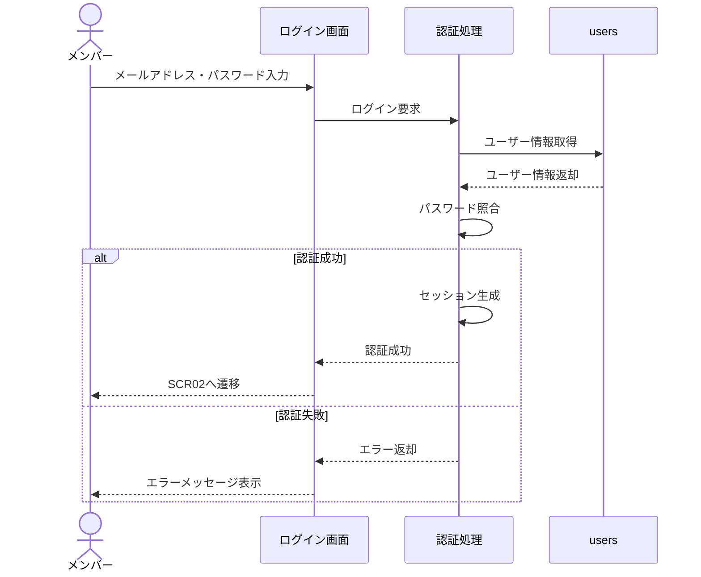
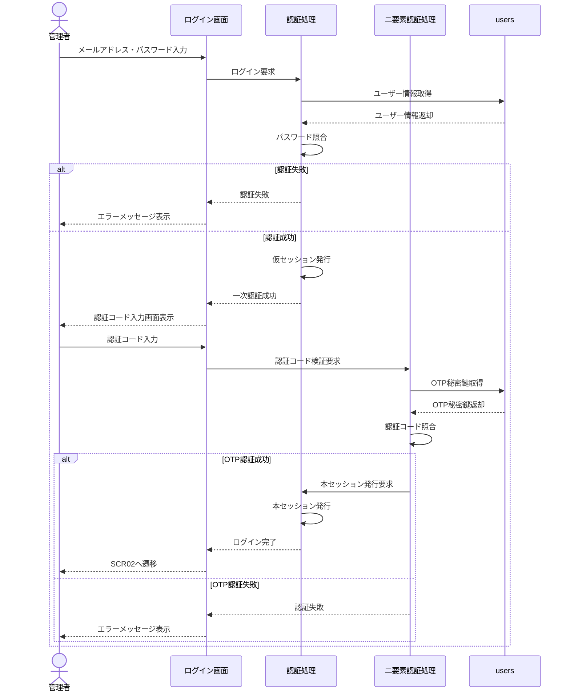
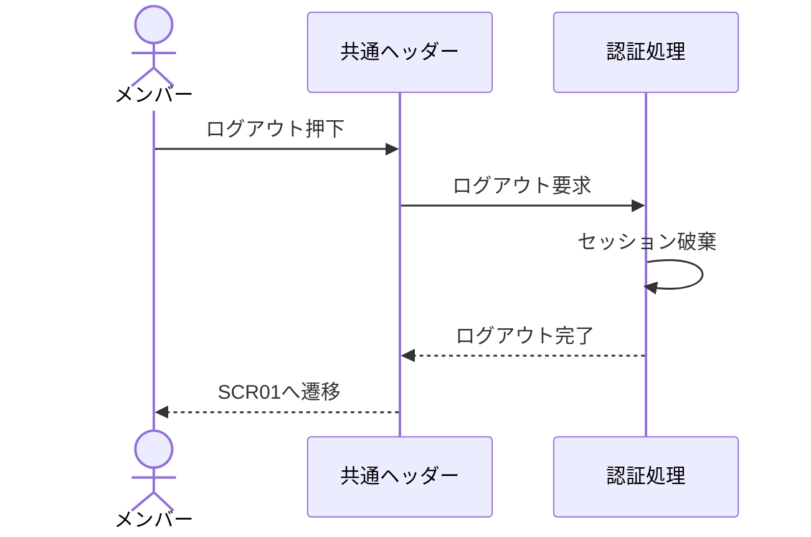
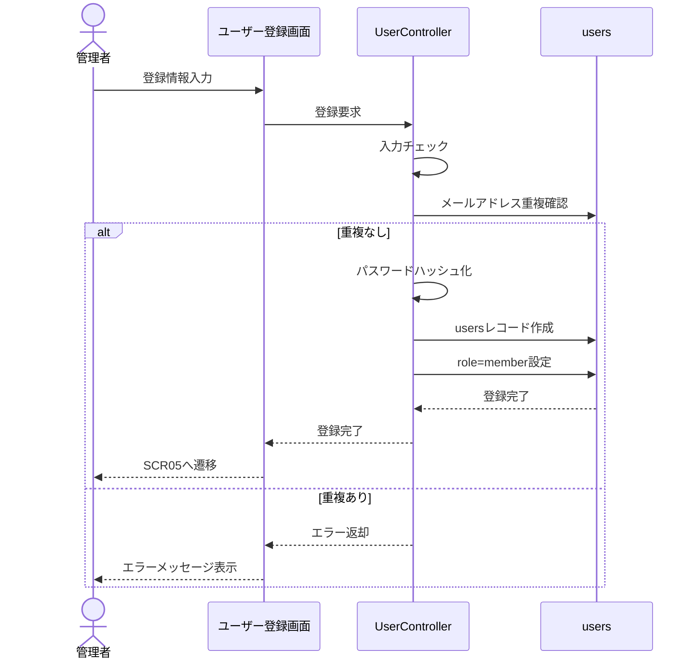
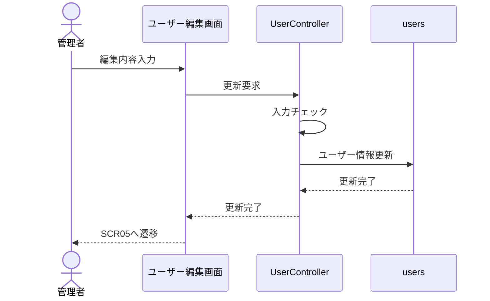
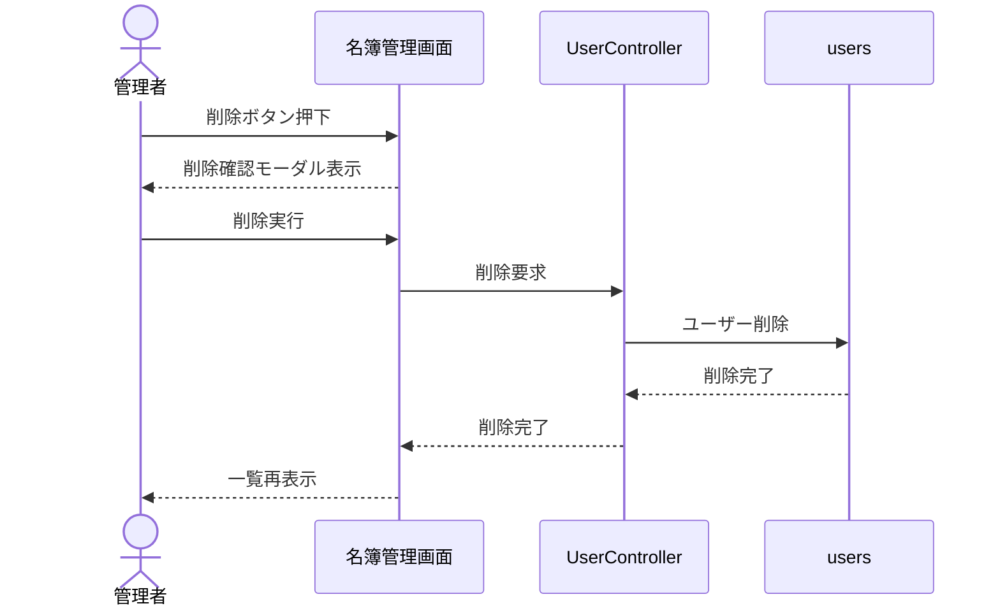
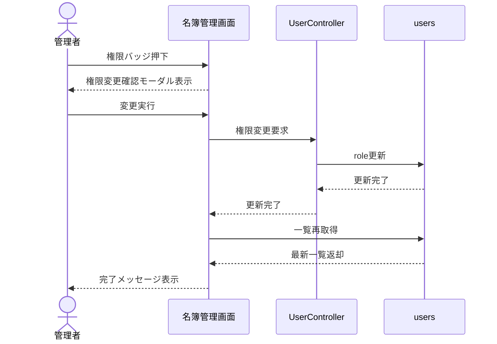
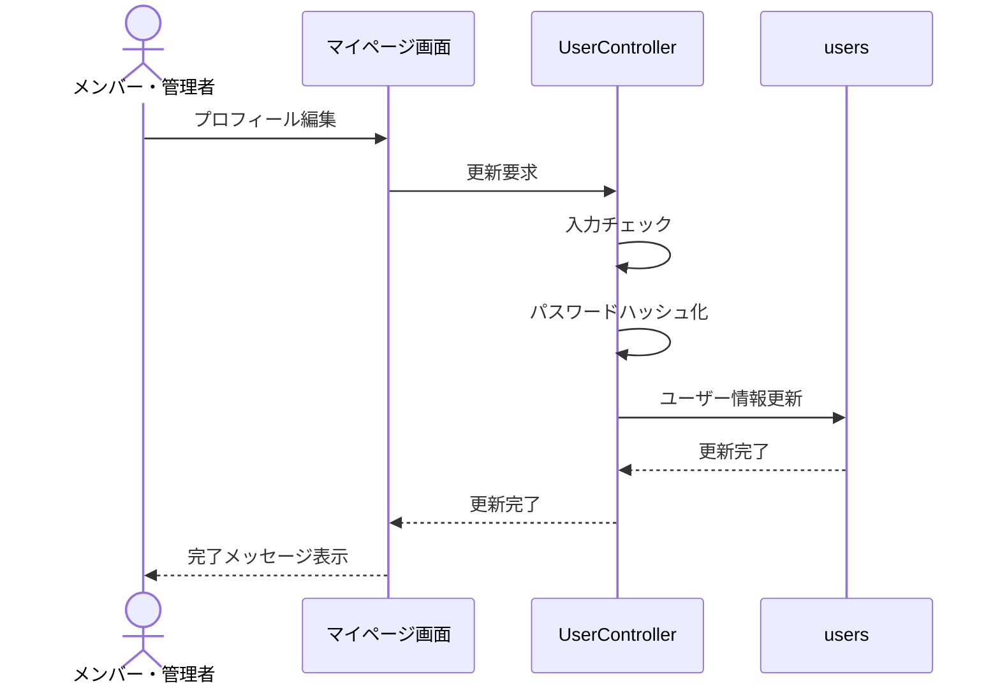
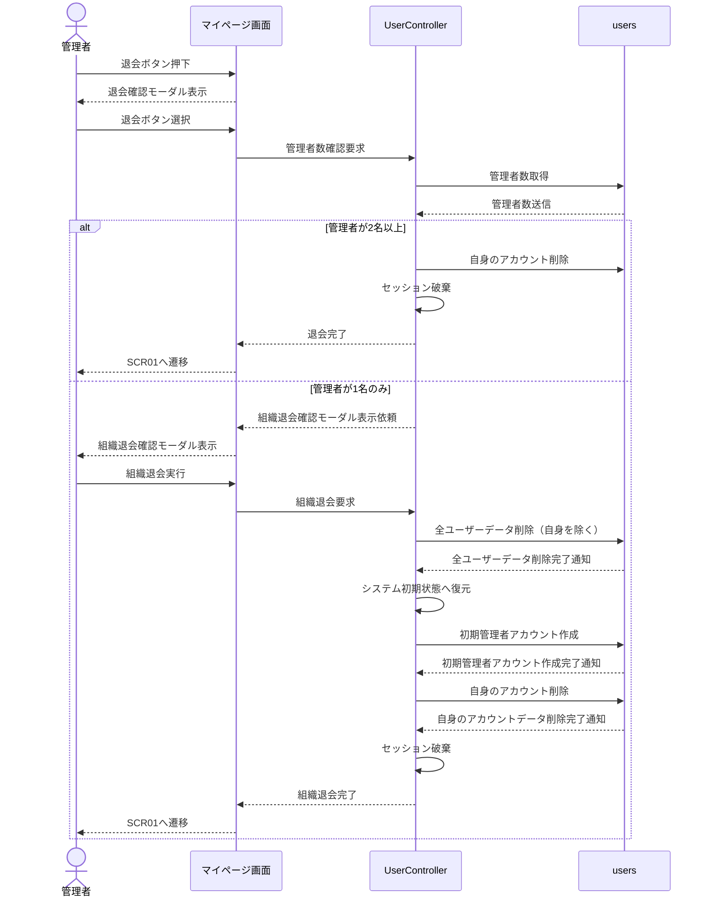

# 3. シーケンス図
## 3.1 ログイン
### 基本ログイン
メンバー　*メンバー権限の場合

### 管理者二要素認証 
管理者（二要素認証）*管理者権限の場合   

---

## 3.2 ログアウト
権限共通

--- 
## 3.3 ユーザー登録

---
## 3.4 ユーザー編集
管理者権限

---
## 3.5 ユーザー削除
管理者権限（他者ユーザーの削除）

## 3.6 権限変更

## 3.7 マイページ更新
共通権限

---
## 3.8 自己退会
管理者権限

---

